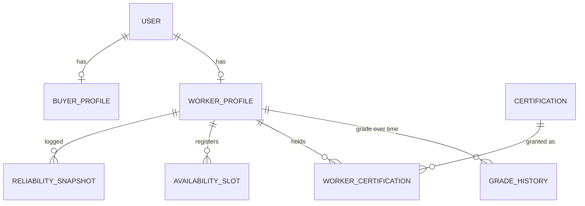
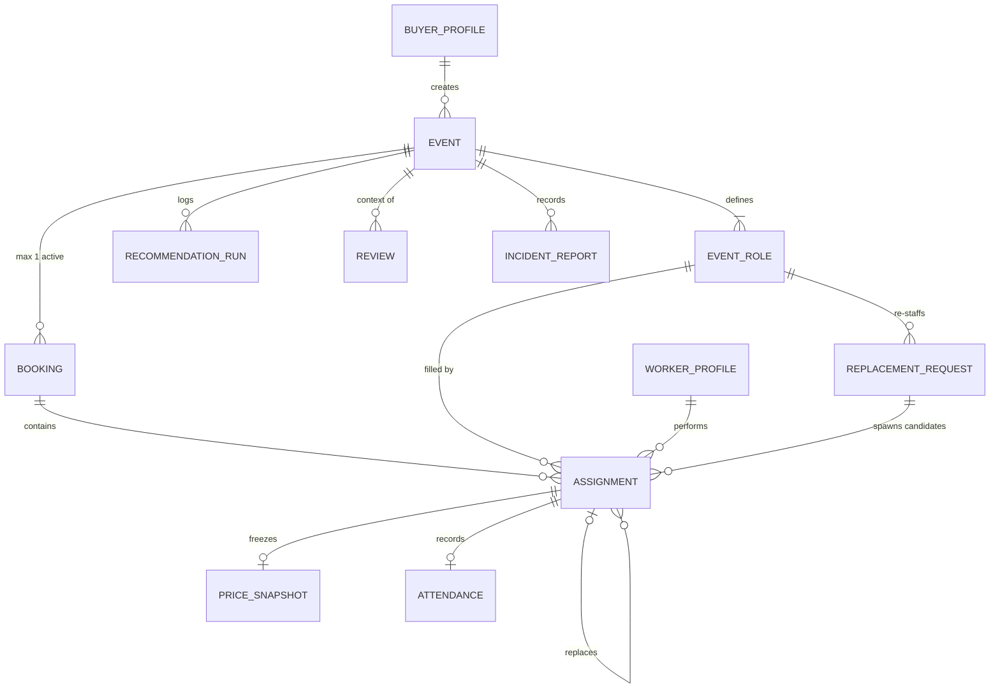
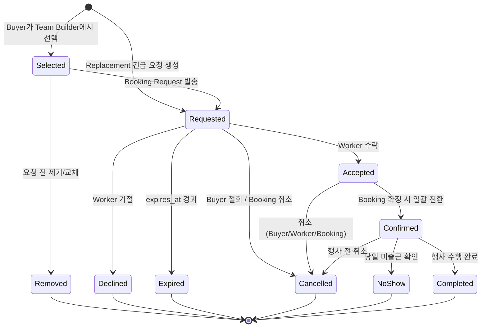
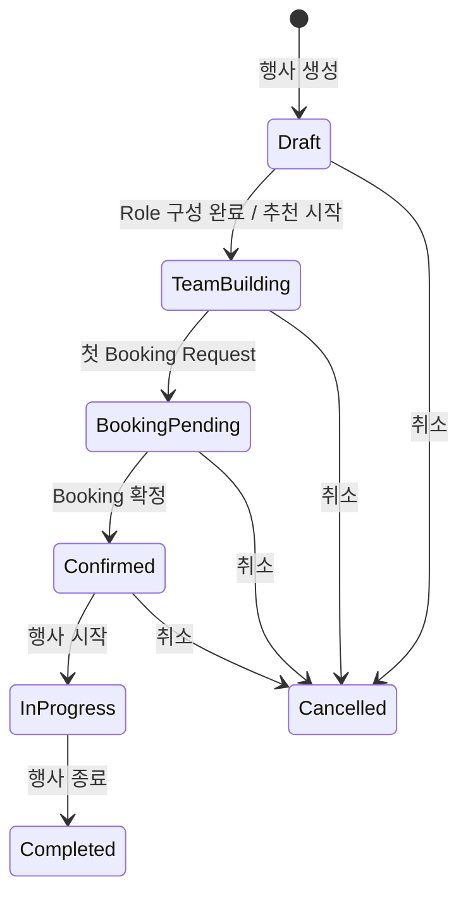

# 도메인 모델

> Version 0.2 (2026-08-08) — 외부 리뷰 반영: Booking 파생 갭 제거(fallback Open), 미충원 마감(closed_unfilled_count), Replacement 성공 재정의, Attendance 구조화, Capacity 용어 통일
> 기준 문서: [기획서](../../README.md), [경계 결정 D1~D5](01-boundary-decisions.md)
> 범위: 엔티티, 관계, 상태기계 소유권, 불변식. 상태 전이의 세부 정책 수치(기한, 패널티)는 Phase 1에서 확정한다.

---

## 1. 표기 원칙

- 엔티티 이름은 영문, 설명은 한국어. 코드/DB 네이밍의 기준이 된다.
- "활성(active)"은 종결 상태가 아닌 행을 뜻한다. 종결 상태는 각 상태기계 절에 명시한다.
- 여기 없는 개념(Team, Leader, Settlement 등)은 실수로 빠진 게 아니라 §9 비-엔티티 선언에 따라 의도적으로 없다.

---

## 2. 엔티티 목록과 책임

### 사람·자격 측

| 엔티티 | 책임 | 핵심 필드 |
|---|---|---|
| **User** | 계정·인증 단위 | email, phone(비공개), status |
| **BuyerProfile** | 발주자 프로필 (User당 0..1) | organization_name(문자열), 담당자 정보 |
| **WorkerProfile** | 공급자 프로필 (User당 0..1). Promoter 활동의 주체 | 사진/Portfolio, 자가신고 skill 태그[], 선호 행사 유형, 활동 지역 |
| **GradeHistory** | Grade(P1~P4) 유효기간 이력. Base Rate의 근거 | grade, effective_from/to, 산정 근거 입력값(JSON) |
| **Certification** | 검증 자격의 정의 (Leader L1~L3, 검증 Skill) | code, kind: leader\|skill, level |
| **WorkerCertification** | Worker ↔ Certification M:N | granted_at, revoked_at |
| **AvailabilitySlot** | 가용 일정. **참고 정보** — 예약 상태를 미러링하지 않는다 | date/time range, emergency_flag |
| **ReliabilitySnapshot** | Reliability 계산값의 주기 로그 (추이 분석용) | score, inputs(JSON), captured_at |

### 행사·거래 측

| 엔티티 | 책임 | 핵심 필드 |
|---|---|---|
| **Event** | 행사. 상태기계 소유 | 행사명/유형/브랜드, 일시, 장소, buyer FK |
| **EventRole** | 행사 내 역할과 요구조건. 정원(capacity) 단위 — 자리별 식별자(Slot)는 없다 | kind: promoter\|leader, required_count(최초 Buyer 수요, 첫 요청 후 불변), closed_unfilled_count(미충원 마감 수, 증가 전용, 기본 0), 최소 Grade, CertificationRequirement 목록(대상 자격·최소 레벨·필수/우대), 소프트 조건(태그), (V2: supervisor_role_id) |
| **RecommendationRun** | 추천 실행의 append-only 로그. 도메인 aggregate 아님 | 입력 조건, 후보 목록(JSON), ran_at |
| **Booking** | Event당 활성 1개인 거래 컨테이너. 상태는 파생 | event FK, 응답기한 정책, cancelled_at(명시 명령의 유일한 흔적) |
| **Assignment** | Worker 1명 ↔ EventRole 정원 1자리. **핵심 상태기계 소유** | booking/role/worker FK, state, expires_at, replaces_assignment_id(자기참조), replacement_request_id(0..1 — 어느 대체 탐색이 낳은 후보인가) |
| **PriceSnapshot** | Requested 진입 시 동결되는 불변 가격 (Assignment당 1) | 라인아이템, pricing_policy FK + policy_version, 적용 grade |
| **PricingPolicy** | 가격 정의의 원천. 버전별 불변 행 — 갱신은 새 버전 발행, 삭제 없음 | version, effective_from/to, Grade→Base Rate 표, Certification Premium, Assignment Premium 규칙 |
| **ReplacementRequest** | 결원 대체 탐색의 기록. 상태기계 소유 | role FK, replaced_assignment FK, requester — 성사 Assignment는 저장하지 않고 파생(§8) |
| **Attendance** | 당일 실제 근무 기록 (Assignment당 0..1) | check_in_at, check_out_at, status: Present\|Absent — 지각/조퇴 분(minute)·실근무시간은 타임스탬프에서 파생(§8), 지각+조퇴 동시 발생도 표현된다 |
| **IncidentReport** | 현장 인력 관련 사건 기록 | event FK, assignment FK(0..1), reporter, 내용 |
| **Review** | Event context 안의 평가. (평가자, 피평가자) 쌍 | event FK, rater(assignment 또는 buyer), ratee, 항목별 점수 |

---

## 3. 관계도

### 사람·자격 측

### 행사·거래 측

PriceSnapshot은 불변 PricingPolicy 행을 FK + version으로 참조한다. 단 스냅샷은 자체 라인아이템만으로 해석이 완결돼야 한다 — FK는 "어느 정책으로 계산했는가"의 provenance이지 해석 의존성이 아니다.

---

## 4. 상태기계 소유권

| 상태기계 | 소유 엔티티 | 성격 |
|---|---|---|
| Event | Event | 명시적 상태 |
| Assignment | Assignment | **핵심 상태기계** — 거래의 진실 원천 |
| Replacement | ReplacementRequest | 명시적 상태 (Open→종결) |
| Booking | 없음 (파생) | 자식 Assignment에서 계산, fallback Open 포함(§6 — 빈 구간 없음) + 명시 명령은 Cancel 하나. 충원 교착의 탈출구는 EventRole의 "미충원 마감" 명령 |
| Availability | 없음 | 참고 정보. Available/Unavailable 구분만 있고 예약 상태를 담지 않는다 (A2) |
| Attendance | 없음 | 운영 라벨이지 도메인 상태기계가 아니다 |

---

## 5. Assignment 상태 전이

종결 상태: `Removed, Declined, Expired, Cancelled, NoShow, Completed`. 활성 상태: `Selected, Requested, Accepted, Confirmed`.

| 전이 | 행위자 | 조건 | 부수효과 |
|---|---|---|---|
| 생성 → Selected | Buyer | Event가 TeamBuilding 상태, Role 유효 정원 여유(I3) | — |
| 생성 → Requested | Platform | ReplacementRequest Open, 긴급 후보 매칭 | replacement_request_id 기록, PriceSnapshot 동결(Emergency Premium 포함), 짧은 expires_at |
| Selected → Removed | Buyer | 요청 전 | — |
| Selected → Requested | Buyer (Booking Request) | Booking 존재(없으면 생성), Role 활성 수 ≤ 유효 정원(I3 — "빈 자리당 동시 요청 1건"이 따름정리로 강제됨) | **PriceSnapshot 동결**, expires_at 설정, Worker 알림. 첫 요청 시 Event 일정·장소·Role 요구조건 잠금(I7) |
| Requested → Accepted | Worker | **시간 겹침 검사 통과**(A3, 트랜잭션) | Buyer 알림 |
| Requested → Declined | Worker | — | 자리 재오픈, 대안 후보 재추천 트리거 |
| Requested → Expired | System | expires_at 경과 | 자리 재오픈, 대안 후보 재추천 트리거 |
| Requested → Cancelled | Buyer / System | — | 자리 재오픈 |
| Accepted → Confirmed | System | Booking 파생 상태가 Confirmed 도달(전 Role 유효 정원 충족) | 전원 알림, D-3/D-1 확인 스케줄 등록 |
| Accepted/Confirmed → Cancelled | Buyer / Worker / System | 취소 정책(Phase 1) 적용 | 자리 재오픈 또는 ReplacementRequest 생성 |
| Confirmed → NoShow | Leader / Buyer 보고 | 당일 미출근 확인 | ReplacementRequest 생성 가능, Reliability 반영 |
| Confirmed → Completed | System (check-out) | Attendance 기록 존재 | 정산 산출(스냅샷 단가 × 실적), Review 요청, Career/Reliability 갱신 |

D-3/D-1 재확인(기획서 §12)은 상태가 아니라 Confirmed 상태 위의 **Attendance Risk 플래그**다. 상태기계를 키우지 않고 §13.2의 Backup 사전 탐색 트리거로만 쓴다.

지각·조퇴는 Attendance 타임스탬프에서 파생되는 late_minutes / early_leave_minutes / actual_hours로 기록하며(동시 발생 표현 가능) Assignment 상태를 바꾸지 않는다(정산이 라인아이템 단가 × 실적이므로 자연 처리).

---

## 6. Event 상태 / Booking 파생 규칙 / ReplacementRequest

### Event

`Recruiting`은 없다(A6 — 공개 지원이 아니라 추천 주도 흐름).

### Booking — 파생 규칙 (우선순위 순 평가)

| 상태 | 규칙 |
|---|---|
| Cancelled | `cancelled_at` 존재 (유일한 명시 명령. 자식 활성 Assignment를 정책에 따라 일괄 Cancelled 처리) |
| Completed | Event Completed이고 모든 자식 Assignment가 종결 |
| Confirmed | 모든 EventRole에서 활성 Accepted+Confirmed 수 = 유효 정원(required_count − closed_unfilled_count) |
| PartiallyAccepted | Accepted+Confirmed ≥ 1 이지만 Confirmed 조건 미달 |
| Requested | 위 어느 것도 아니고 Requested ≥ 1 |
| **Open** | fallback — 위 어느 것도 아님 (예: 전 후보가 Declined/Expired로 활성 0). 재충원 필요 신호 |

- **파생에 빈 구간이 없다**: 어떤 Assignment 조합도 최소한 Open에 걸린다.
- 부분 수락 교착의 탈출구는 상태 오버라이드가 아니라 EventRole의 **"미충원 마감" 명령**이다: `closed_unfilled_count`를 늘리면(`required_count`는 불변) 파생 로직이 유효 정원 충족을 계산해 Confirmed에 도달한다. 최초 수요와 마감 결정이 둘 다 보존되므로 Original Fill Rate와 Final Coverage를 모두 계산할 수 있다(§8).
- 확정 후 이탈 시 Booking은 PartiallyAccepted/Open으로 회귀하지만, "거래가 확정되었다"는 사실은 **Event.Confirmed가 latch로 보존**한다(Event 상태는 회귀하지 않는다). Event=BookingPending + Booking=PartiallyAccepted는 초기 충원 중, Event=Confirmed + Booking=Open은 확정된 행사의 재충원 중 — 별도 Booking lifecycle이 필요 없는 이유다.
- 충원 현황의 정량 뷰는 §8의 projection(숫자)으로 계산하며, 별도 상태 enum을 두지 않는다.

### ReplacementRequest

`Open → Matched → Fulfilled | Failed | Cancelled` (+ `Matched → Open` 회귀)

- Open: Leader/Buyer가 결원 보고, 긴급 후보 탐색 중. 후보에게 보낸 요청은 `replacement_request_id`를 가진 Assignment로 생성된다 — 거절/만료된 후보까지 전부 추적된다(요청당 후보 수, Accept Rate, 매칭 시간, 도착 시간 분석용)
- Matched: 후보 Assignment가 Accepted 도달. **아직 성공이 아니다**
- Fulfilled: 대체 Worker가 **현장 Check-in** — 성공의 정의는 수락이 아니라 도착이다 (§25 Replacement Success Rate의 분자)
- Matched → Open: 매칭된 대체자마저 취소/노쇼 → 재탐색
- Failed: 후보 소진/시간 초과 — 실패도 도메인 기록이다
- Cancelled: 요청 철회
- 성사 Assignment는 별도 FK로 저장하지 않는다 — `replacement_request_id = 자기`인 Assignment 중 Accepted 이후 상태에 도달한 것으로 파생(한 사실 한 저장소, §8)

---

## 7. 불변식과 제약

구현 시 전부 DB 제약 또는 트랜잭션 규칙으로 강제한다 (Phase 3 ERD에서 매핑).

| # | 불변식 | 강제 수단(예상) |
|---|---|---|
| I1 | Event당 활성 Booking ≤ 1 | 부분 유니크 인덱스 |
| I2 | (worker, event)당 활성 Assignment ≤ 1 — "한 Worker는 한 Event에서 하나의 Role만"이라는 비즈니스 결정([01 부속결정 A1](01-boundary-decisions.md)) | 부분 유니크 인덱스 |
| I3 | EventRole당 활성 Assignment 수 ≤ 유효 정원(required_count − closed_unfilled_count). "빈 자리당 동시 Requested 1건"(A4)은 이 불변식의 따름정리 | 트랜잭션 검사 |
| I4 | closed_unfilled_count는 증가만 가능하며, 활성 Assignment가 있는 자리를 마감할 수 없다(closed ≤ required − 활성 수) | 트랜잭션 검사 |
| I5 | PriceSnapshot은 Requested 진입 시 필수 생성, 이후 불변 | 애플리케이션 규칙 + 갱신 금지 |
| I6 | Accept 시 Worker의 기존 Accepted/Confirmed와 시간 겹침 금지 | 트랜잭션 검사 (신뢰 경계 — DB 수준) |
| I7 | 첫 Booking Request 이후 Event 일시/장소와 EventRole 요구조건(required_count, Grade·Certification 조건) 변경 금지 — Worker가 보고 수락한 조건의 보호. 정원 축소는 수정이 아니라 "미충원 마감" 명령 | 애플리케이션 규칙 |
| I8 | leader형 Role 배정자는 활성 LeaderCertification ≥ 요구 레벨 | 선택/요청 시점 검증 |
| I9 | Event당 leader형 EventRole ≤ 1 (MVP) | 검증 규칙 |

---

## 8. 파생값 정의

| 파생값 | 정의 |
|---|---|
| Team (projection) | Event의 활성 Assignment를 EventRole별로 그룹한 뷰. Recommended/Confirmed는 상태 필터 |
| Booking 상태 | §6 파생 규칙 (fallback Open 포함 — 빈 구간 없음) |
| Booking 총액 | Σ 활성 Assignment의 PriceSnapshot amount |
| 유효 정원 | EventRole.required_count − closed_unfilled_count |
| 충원 현황 projection | Role별 {required, closed_unfilled, accepted, requested, remaining}. KPI: Original Demand = required, Final Target = 유효 정원, Original Fill Rate = 충원/required, Final Coverage = 충원/유효 정원 |
| ReplacementRequest 성사 Assignment | replacement_request_id가 자기를 가리키는 Assignment 중 Accepted 이후 상태에 도달한 것 |
| 지각/조퇴/실근무 | Attendance 타임스탬프 vs Event 시간: late_minutes, early_leave_minutes, actual_hours |
| "대체됨" | 자기를 `replaces_assignment_id`로 가리키는 Assignment의 존재 |
| Reliability | f(No-show, Late, Cancellation, 완료 수, Rehire, 평가, Confirmation 응답) — 산식 Phase 1. 계산값이며 주기 스냅샷만 로그 |
| 정산액(post-MVP) | Σ (스냅샷 동결 단가 × Attendance 실적) + 고정수당 라인 |

---

## 9. 비-엔티티 선언

| 개념 | 엔티티가 아닌 이유 | 표현 방법 |
|---|---|---|
| Team / Crew | 저장하면 Assignment와 이중 진실 | projection (D1) |
| Leader | User Type이 아니라 자격 | LeaderCertification + Role kind (D3) |
| Reliability | 산식이 바뀔 수 있는 계산값 | 계산 + ReliabilitySnapshot 로그 (D4) |
| Settlement | post-MVP (§26), 지금은 파생 가능 | 스냅샷 × 실적 (D5) |
| Organization | 정산 자동화 전까지 불필요 | BuyerProfile.organization_name 문자열 (D3) |
| Recommendation | 도메인 판단이 아니라 서비스 실행 | RecommendationRun 로그 (D1) |

---

## 10. 열린 이슈

- 다중 Leader(Crew) — `supervisor_role_id` 경로만 고정, 결정 보류 ([01 §D1](01-boundary-decisions.md))
- 취소 정책·No-show 정의·비용부담 주체 — 상태 전이의 조건 칸을 Phase 1에서 채운다
- Review 매트릭스 상세(항목, 공개 범위) — Phase 2
- 정책 수치 전부(단가, 기한, 프리미엄) — Phase 1 Pricing Rule Table
- 다중 Shift/다일 행사 — MVP는 단일 근무 시간대 전제([01 부속결정 A7](01-boundary-decisions.md)), 필요해지면 Event—EventShift—EventRole 계층 삽입
- 자격 요구조건의 저장 형태(배열 vs 관계 테이블) — 의미는 값 객체로 확정, 형태는 Phase 3 ERD에서 추천 쿼리 빈도 기준으로 결정

---

## 11. 용어집

| 영문 | 국문 | 정의 |
|---|---|---|
| Worker | 공급자 | 행사 업무를 수행하는 사람. Promoter 활동과 Leader 자격의 공통 주체 |
| Buyer | 발주자 | 행사 인력을 구성·구매하는 주체 |
| Event | 행사 | 서비스의 중심 객체 |
| EventRole | 행사 역할 | 행사 내 역할 정의와 요구조건. kind로 promoter/leader 구분 |
| Assignment | 배정 | Worker 1명과 EventRole 정원 1자리의 연결. 거래의 최소 단위 |
| Booking | 예약 | Event 단위 거래 컨테이너 |
| PriceSnapshot | 가격 스냅샷 | 요청 시점에 동결되는 불변 가격 내역 |
| Grade | 등급 | 플랫폼 산정 P1~P4. Base Rate 결정 |
| Certification | 자격 | 검증된 능력/역할 자격. Premium의 근거 |
| Reliability | 신뢰도 | 내부 운영용 계산 점수 (공개 Rating과 분리) |
| Replacement | 대체 투입 | 결원을 새 Assignment로 채우는 과정 |
| Attendance | 출결 | 당일 실제 근무 기록 |
