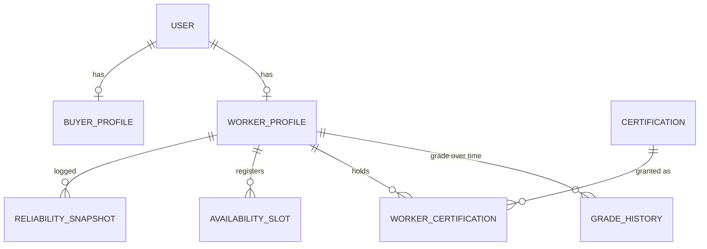
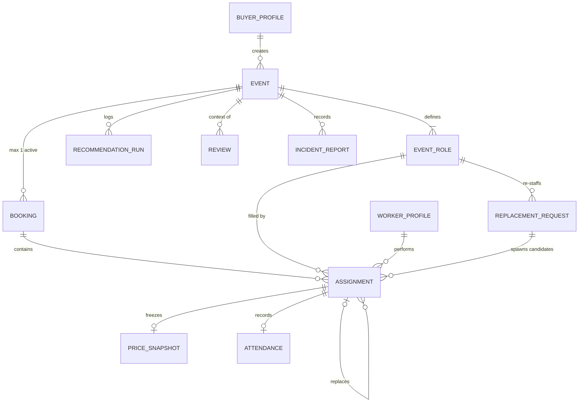
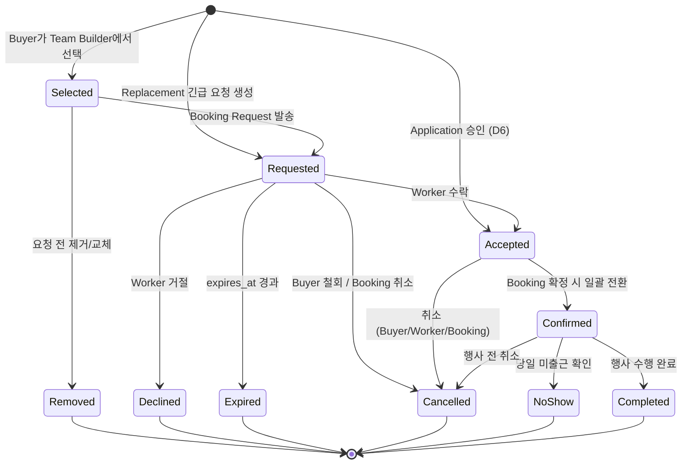
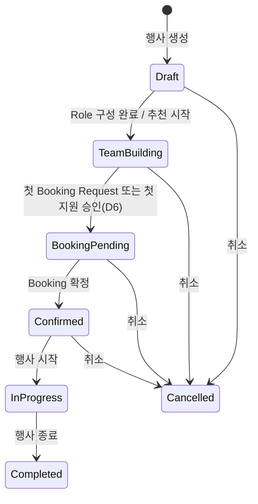

# 도메인 모델

> Version 0.5 (2026-08-10) — worker_interview 수용: WorkerProfile 옵트인 연락 메모·불가 조건 필드, §10 열린 이슈 추가(행사 특성 조건 축·Event Room·온도/P2P Review·신규 공고 알림)
> Version 0.4 (2026-08-08) — D6 외부 리뷰 반영: I10 Role 단위 완화, Application 감사 필드·closed_reason, Standby Pool 기본 방향, I11 시각 기반 재정의, 충원 projection 산식 명시
> Version 0.3 (2026-08-08) — D6 반영: Application 엔티티·상태기계, EventRole 게시 속성, Assignment 진입 경로 추가(생성→Accepted), I5·I6·I7 개정, I10·I11 신설
> Version 0.2 (2026-08-08) — 외부 리뷰 반영: Booking 파생 갭 제거(fallback Open), 미충원 마감(closed_unfilled_count), Replacement 성공 재정의, Attendance 구조화, Capacity 용어 통일
> 기준 문서: [기획서](../../README.md), [경계 결정 D1~D6](01-boundary-decisions.md)
> 범위: 엔티티, 관계, 상태기계 소유권, 불변식. 상태 전이의 세부 정책 수치(기한, 패널티)는 Phase 1에서 확정한다.

---

## 1. 표기 원칙

- 엔티티 이름은 영문, 설명은 한국어. 코드/DB 네이밍의 기준이 된다.
- "활성(active)"은 종결 상태가 아닌 행을 뜻한다. 종결 상태는 각 상태기계 절에 명시한다.
- 여기 없는 개념(Team, Leader, Settlement 등)은 실수로 빠진 게 아니라 §9 비-엔티티 선언에 따라 의도적으로 없다.

---

## 2. 엔티티 목록과 책임

### 사람·자격 측

| 엔티티 | 책임 | 핵심 필드 |
|---|---|---|
| **User** | 계정·인증 단위 | email, phone(비공개), status |
| **BuyerProfile** | 발주자 프로필 (User당 0..1) | organization_name(문자열), 담당자 정보 |
| **WorkerProfile** | 공급자 프로필 (User당 0..1). Promoter 활동의 주체 | 사진/Portfolio, 자가신고 skill 태그[], 선호 행사 유형, 활동 지역, 옵트인 연락 메모(인스타·연락처 — 기본 미등록, 노출 범위 `[정책]`, 기획서 §14.1), 불가 조건(하드 제외 — 행사 특성 조건 축과 동일 태그, §10) |
| **GradeHistory** | Grade(P1~P4) 유효기간 이력. Base Rate의 근거 | grade, effective_from/to, 산정 근거 입력값(JSON) |
| **Certification** | 검증 자격의 정의 (Leader L1~L3, 검증 Skill) | code, kind: leader\|skill, level |
| **WorkerCertification** | Worker ↔ Certification M:N | granted_at, revoked_at |
| **AvailabilitySlot** | 가용 일정. **참고 정보** — 예약 상태를 미러링하지 않는다 | date/time range, emergency_flag |
| **ReliabilitySnapshot** | Reliability 계산값의 주기 로그 (추이 분석용) | score, inputs(JSON), captured_at |

### 행사·거래 측

| 엔티티 | 책임 | 핵심 필드 |
|---|---|---|
| **Event** | 행사. 상태기계 소유 | 행사명/유형/브랜드, 일시, 장소, buyer FK |
| **EventRole** | 행사 내 역할과 요구조건. 정원(capacity) 단위 — 자리별 식별자(Slot)는 없다. 공개 모집의 게시 단위(D6) | kind: promoter\|leader, required_count(최초 Buyer 수요, 첫 요청 후 불변), closed_unfilled_count(미충원 마감 수, 증가 전용, 기본 0), 최소 Grade, CertificationRequirement 목록(대상 자격·최소 레벨·필수/우대), 소프트 조건(태그), posted_at(최초 공개 게시, 불변 — I7 래치 앵커)·posting_closed_at(마감, 재게시 시 클리어 — 재게시 이력은 미보존, §10 PostingLog 참조. "모집 중"은 §8 파생), (V2: supervisor_role_id) |
| **RecommendationRun** | 추천 실행의 append-only 로그. 도메인 aggregate 아님 | 입력 조건, 후보 목록(JSON), ran_at |
| **Booking** | Event당 활성 1개인 거래 컨테이너. 상태는 파생. 첫 Booking Request **또는 첫 Application 승인**(D6) 시 생성 | event FK, 응답기한 정책, cancelled_at(명시 명령의 유일한 흔적) |
| **Assignment** | Worker 1명 ↔ EventRole 정원 1자리. **핵심 상태기계 소유** | booking/role/worker FK, state, expires_at, replaces_assignment_id(자기참조), replacement_request_id(0..1 — 어느 대체 탐색이 낳은 후보인가), application_id(0..1 — 어느 지원이 물질화됐는가, D6) |
| **Application** | 공개 모집에 대한 Worker의 지원 의사 기록. 상태기계 소유. **정원 비점유** — 계약은 승인 시 Accepted Assignment로 물질화(D6) | event_role FK, worker FK, status, applied_at, expires_at `[정책]`, decided_at, closed_reason(EVENT_CANCELLED\|EVENT_STARTED\|CAPACITY_FILLED\|OTHER_ROLE_APPROVED\|DIRECT_ASSIGNMENT_ACCEPTED\|ROLE_CLOSED), 감사 필드 3(displayed_amount·pricing_policy_version_at_apply·grade_at_apply — 지원 시 서버 기록·불변, **표시의 증거이지 계약 가격 아님**·정산 비구속, D6 결정 6) |
| **PriceSnapshot** | **최초 구속 상태 진입 시**(지명 Requested 진입 / 지원 승인에 의한 Accepted 생성 — I5) 동결되는 불변 가격 (Assignment당 1) | 라인아이템, pricing_policy FK + policy_version, 적용 grade |
| **PricingPolicy** | 가격 정의의 원천. 버전별 불변 행 — 갱신은 새 버전 발행, 삭제 없음 | version, effective_from/to, Grade→Base Rate 표, Certification Premium, Assignment Premium 규칙 |
| **ReplacementRequest** | 결원 대체 탐색의 기록. 상태기계 소유 | role FK, replaced_assignment FK, requester — 성사 Assignment는 저장하지 않고 파생(§8) |
| **Attendance** | 당일 실제 근무 기록 (Assignment당 0..1) | check_in_at, check_out_at, status: Present\|Absent — 지각/조퇴 분(minute)·실근무시간은 타임스탬프에서 파생(§8), 지각+조퇴 동시 발생도 표현된다 |
| **IncidentReport** | 현장 인력 관련 사건 기록 | event FK, assignment FK(0..1), reporter, 내용 |
| **Review** | Event context 안의 평가. (평가자, 피평가자) 쌍 | event FK, rater(assignment 또는 buyer), ratee, 항목별 점수 |

---

## 3. 관계도

### 사람·자격 측

### 행사·거래 측

PriceSnapshot은 불변 PricingPolicy 행을 FK + version으로 참조한다. 단 스냅샷은 자체 라인아이템만으로 해석이 완결돼야 한다 — FK는 "어느 정책으로 계산했는가"의 provenance이지 해석 의존성이 아니다.

---

## 4. 상태기계 소유권

| 상태기계 | 소유 엔티티 | 성격 |
|---|---|---|
| Event | Event | 명시적 상태 |
| Assignment | Assignment | **핵심 상태기계** — 거래의 진실 원천 |
| Replacement | ReplacementRequest | 명시적 상태 (Open→종결) |
| Application | Application | 명시적 상태 (Open→종결). 승인의 산출물은 application_id를 가진 Assignment로 파생(§8) |
| Booking | 없음 (파생) | 자식 Assignment에서 계산, fallback Open 포함(§6 — 빈 구간 없음) + 명시 명령은 Cancel 하나. 충원 교착의 탈출구는 EventRole의 "미충원 마감" 명령 |
| Availability | 없음 | 참고 정보. Available/Unavailable 구분만 있고 예약 상태를 담지 않는다 (A2) |
| Attendance | 없음 | 운영 라벨이지 도메인 상태기계가 아니다 |

---

## 5. Assignment 상태 전이

종결 상태: `Removed, Declined, Expired, Cancelled, NoShow, Completed`. 활성 상태: `Selected, Requested, Accepted, Confirmed`.

| 전이 | 행위자 | 조건 | 부수효과 |
|---|---|---|---|
| 생성 → Selected | Buyer | Event가 TeamBuilding 상태, Role 유효 정원 여유(I3) | — |
| 생성 → Requested | Platform | ReplacementRequest Open, 긴급 후보 매칭 | replacement_request_id 기록, PriceSnapshot 동결(Emergency Premium 포함), 짧은 expires_at |
| 생성 → Accepted | Buyer (Application 승인, D6) | 원자 트랜잭션: I3(정원 — 동시 승인 직렬화), I2(같은 worker·event 활성 Assignment 없음), I6(시간 겹침), I8(leader Role 재검). 동결 예정가 < 지원 당시 displayed_amount이면 Worker 재확인 `[정책]` | application_id 기록, **PriceSnapshot 동결(I5)**, Booking 없으면 생성(I1), Event TeamBuilding→BookingPending, 같은 (worker, event)의 자기 Selected/Requested 자동 종결, **같은 (worker, event)의 나머지 Open Application 일괄 Closed(OTHER_ROLE_APPROVED — 어느 채널이든 계약 성립이 잔여 지원을 종결)**, Worker 알림 |
| Selected → Removed | Buyer | 요청 전 | — |
| Selected → Requested | Buyer (Booking Request) | Booking 존재(없으면 생성), Role 활성 수 ≤ 유효 정원(I3 — "빈 자리당 동시 요청 1건"이 따름정리로 강제됨) | **PriceSnapshot 동결**, expires_at 설정, Worker 알림. 첫 요청 시 Event 일정·장소·Role 요구조건 잠금(I7) |
| Requested → Accepted | Worker | **시간 겹침 검사 통과**(A3, 트랜잭션) | Buyer 알림 |
| Requested → Declined | Worker | — | 자리 재오픈, 대안 후보 재추천 트리거 |
| Requested → Expired | System | expires_at 경과 | 자리 재오픈, 대안 후보 재추천 트리거 |
| Requested → Cancelled | Buyer / System | — | 자리 재오픈 |
| Accepted → Confirmed | System | Booking 파생 상태가 Confirmed 도달(전 Role 유효 정원 충족) | 전원 알림, D-3/D-1 확인 스케줄 등록 |
| Accepted/Confirmed → Cancelled | Buyer / Worker / System | 취소 정책(Phase 1) 적용 | 자리 재오픈 또는 ReplacementRequest 생성 |
| Confirmed → NoShow | Leader / Buyer 보고 | 당일 미출근 확인 | ReplacementRequest 생성 가능, Reliability 반영 |
| Confirmed → Completed | System (check-out) | Attendance 기록 존재 | 정산 산출(스냅샷 단가 × 실적), Review 요청, Career/Reliability 갱신 |

D-3/D-1 재확인(기획서 §12)은 상태가 아니라 Confirmed 상태 위의 **Attendance Risk 플래그**다. 상태기계를 키우지 않고 §13.2의 Backup 사전 탐색 트리거로만 쓴다. **D-3 이후에 성립·확정된 Assignment**(임박 지명·Standby 지원 승인·Replacement 공히)는 지난 체크포인트를 등록하지 않고 **즉시 확인 1회**로 대체한다 `[정책]` — 확인 장치 없이 당일로 직행하는 조합을 막는다.

지각·조퇴는 Attendance 타임스탬프에서 파생되는 late_minutes / early_leave_minutes / actual_hours로 기록하며(동시 발생 표현 가능) Assignment 상태를 바꾸지 않는다(정산이 라인아이템 단가 × 실적이므로 자연 처리).

---

## 6. Event 상태 / Booking 파생 규칙 / ReplacementRequest / Application

### Event

`Recruiting`은 없다(A6 유지 — 공개 모집(D6)은 EventRole 단위 게시 속성이며 Event lifecycle과 직교한다. "모집 중"은 §8 파생 predicate).

전이 트리거: `Confirmed→InProgress`는 **System이 행사 시작 시각에** 전이하고, `InProgress→Completed`는 System(행사 종료)이다. 부분 수락 교착으로 Confirmed에 도달하지 못한 행사는 InProgress로 전이하지 않지만, 게시·지원의 종결은 I11이 **시각 기반**으로 별도 보장한다(지난 행사에 지원이 접수·승인되는 구멍 차단).

### Booking — 파생 규칙 (우선순위 순 평가)

| 상태 | 규칙 |
|---|---|
| Cancelled | `cancelled_at` 존재 (유일한 명시 명령. 자식 활성 Assignment를 정책에 따라 일괄 Cancelled 처리) |
| Completed | Event Completed이고 모든 자식 Assignment가 종결 |
| Confirmed | 모든 EventRole에서 활성 Accepted+Confirmed 수 = 유효 정원(required_count − closed_unfilled_count) |
| PartiallyAccepted | Accepted+Confirmed ≥ 1 이지만 Confirmed 조건 미달 |
| Requested | 위 어느 것도 아니고 Requested ≥ 1 |
| **Open** | fallback — 위 어느 것도 아님 (예: 전 후보가 Declined/Expired로 활성 0). 재충원 필요 신호 |

- **파생에 빈 구간이 없다**: 어떤 Assignment 조합도 최소한 Open에 걸린다.
- 부분 수락 교착의 탈출구는 상태 오버라이드가 아니라 EventRole의 **"미충원 마감" 명령**이다: `closed_unfilled_count`를 늘리면(`required_count`는 불변) 파생 로직이 유효 정원 충족을 계산해 Confirmed에 도달한다. 최초 수요와 마감 결정이 둘 다 보존되므로 Original Fill Rate와 Final Coverage를 모두 계산할 수 있다(§8).
- 확정 후 이탈 시 Booking은 PartiallyAccepted/Open으로 회귀하지만, "거래가 확정되었다"는 사실은 **Event.Confirmed가 latch로 보존**한다(Event 상태는 회귀하지 않는다). Event=BookingPending + Booking=PartiallyAccepted는 초기 충원 중, Event=Confirmed + Booking=Open은 확정된 행사의 재충원 중 — 별도 Booking lifecycle이 필요 없는 이유다.
- 충원 현황의 정량 뷰는 §8의 projection(숫자)으로 계산하며, 별도 상태 enum을 두지 않는다.
- **Application은 파생 입력이 아니다.** Approved가 Accepted Assignment로 물질화되는 순간에만 파생에 나타난다 — 규칙 무변경(D6). "지원 검토 중"은 Booking 상태가 아니라 §8 지원 현황 projection의 숫자다.

### ReplacementRequest

`Open → Matched → Fulfilled | Failed | Cancelled` (+ `Matched → Open` 회귀)

- Open: Leader/Buyer가 결원 보고, 긴급 후보 탐색 중. 후보에게 보낸 요청은 `replacement_request_id`를 가진 Assignment로 생성된다 — 거절/만료된 후보까지 전부 추적된다(요청당 후보 수, Accept Rate, 매칭 시간, 도착 시간 분석용)
- Matched: 후보 Assignment가 Accepted 도달. **아직 성공이 아니다**
- Fulfilled: 대체 Worker가 **현장 Check-in** — 성공의 정의는 수락이 아니라 도착이다 (§25 Replacement Success Rate의 분자)
- Matched → Open: 매칭된 대체자마저 취소/노쇼 → 재탐색
- Failed: 후보 소진/시간 초과 — 실패도 도메인 기록이다
- Cancelled: 요청 철회
- 성사 Assignment는 별도 FK로 저장하지 않는다 — `replacement_request_id = 자기`인 Assignment 중 Accepted 이후 상태에 도달한 것으로 파생(한 사실 한 저장소, §8)

### Application (D6)

`Open → Approved | Declined | Withdrawn | Expired | Closed` — 활성 상태는 Open 하나, 나머지 전부 종결. **지원은 정원을 점유하지 않는다 — 점유는 승인이다.**

| 전이 | 행위자 | 조건 | 부수효과 |
|---|---|---|---|
| 생성 → Open | Worker | Role이 모집 중(§8 파생), (worker, event_role) 활성 Application 없음(I10 — 같은 행사의 다른 Role 지원과 병존 가능), (worker, event) 활성 Assignment 없음, 행사당 동시 지원 수 `[정책]` 이내, 하드 요구조건 충족(최소 Grade·필수 Certification, leader Role이면 I8), Role별 지원자 수 상한 `[정책]` | Buyer 알림(묶음 규칙 `[정책]`). **감사 필드 3개 서버 기록**(지원 트랜잭션 안에서 표시 로직 재실행 — 클라이언트 신고값 아님, D6 결정 6). 열람 자체는 저장 없음 |
| Open → Approved | Buyer | 원자 트랜잭션 — §5의 "생성 → Accepted" 전이와 동일 검사(I2·I3·I6·I8). 동결 예정가 < displayed_amount이면 Worker 재확인 `[정책]` | {Assignment: 생성→Accepted} 물질화 — 부수효과 전체는 §5 전이 표 참조 |
| Open → Declined | Buyer | — | Worker 알림. 사유 노출 범위 `[정책]` |
| Open → Withdrawn | Worker | — | Buyer 통지 여부 `[정책]`(무통지 시 승인 시도 시점에야 발견됨 — 비대칭 인지) |
| Open → Expired | System | applied_at + 지원 유효기한 `[정책]` 경과 | — |
| Open → Closed | System | 행사 취소(사유 EVENT_CANCELLED)·행사 시작 시각 경과(EVENT_STARTED — I11 시각 기반), 같은 (worker, event)의 계약 성립 supersede — 지명 성립(DIRECT_ASSIGNMENT_ACCEPTED) 또는 타 Role 지원 승인(OTHER_ROLE_APPROVED). 정원 충족(CAPACITY_FILLED)·미충원 마감(ROLE_CLOSED)의 일괄 종결 여부는 `[정책]` — **기본 방향은 종결하지 않고 Standby 유지**(D6 결정 7) | closed_reason 기록, Worker 알림 `[정책]` |

- **게시 마감 ≠ 지원 일괄 종결**: 마감(posting_closed_at)은 신규 접수만 차단한다. 접수된 Open 지원은 마감 후에도 검토·승인 가능하다(D6 결정 7).
- **승인 실패는 상태가 아니다**: 겹침·정원 초과로 승인 트랜잭션이 실패하면 Open 유지. "지금 승인 가능한가"는 §8의 파생 표시로 처리한다 — 상태기계를 키우지 않는다.
- **정원 충족 ≠ 지원 일괄 종결(기본 방향 — Standby Pool)**: 잔여 Open 지원은 유지한다. 확정 후 이탈·결원 시 Buyer가 기존 지원자를 즉시 승인해 재충원하는 백업 풀이다([01 D6 결정 7](01-boundary-decisions.md)). "정원 충족 — 대기"는 §8 파생 표시(상태 추가 없음)이고, 대기의 상한은 expires_at `[정책]`과 I11(행사 시작 시각)이 구조적으로 보장한다. Standby 승인으로 결원이 해소되면 진행 중 ReplacementRequest는 기존 Cancelled(요청 철회 — 결원 해소) 전이로 정리한다.

---

## 7. 불변식과 제약

구현 시 전부 DB 제약 또는 트랜잭션 규칙으로 강제한다 (Phase 3 ERD에서 매핑).

| # | 불변식 | 강제 수단(예상) |
|---|---|---|
| I1 | Event당 활성 Booking ≤ 1 | 부분 유니크 인덱스 |
| I2 | (worker, event)당 활성 Assignment ≤ 1 — "한 Worker는 한 Event에서 하나의 Role만"이라는 비즈니스 결정([01 부속결정 A1](01-boundary-decisions.md)) | 부분 유니크 인덱스 |
| I3 | EventRole당 활성 Assignment 수 ≤ 유효 정원(required_count − closed_unfilled_count). "빈 자리당 동시 Requested 1건"(A4)은 이 불변식의 따름정리 | 트랜잭션 검사 |
| I4 | closed_unfilled_count는 증가만 가능하며, 활성 Assignment가 있는 자리를 마감할 수 없다(closed ≤ required − 활성 수) | 트랜잭션 검사 |
| I5 | PriceSnapshot은 Assignment의 **최초 구속 상태 진입 시** 필수 생성, 이후 불변 — 지명 경로는 Requested 진입, 지원 경로는 승인에 의한 Accepted 생성 시(D6) | 애플리케이션 규칙 + 갱신 금지 |
| I6 | **Accepted 성립 시**(지명 수락·지원 승인 공히, A3) Worker의 기존 Accepted/Confirmed와 시간 겹침 금지 | 트랜잭션 검사 (신뢰 경계 — DB 수준) |
| I7 | **잠금 시점 = min(첫 Booking Request, 첫 공개 게시)** — 게시 철회로 풀리지 않는 래치(D6). 이후 Event 일시/장소와 EventRole 요구조건(required_count, Grade·Certification 조건) 변경 금지 — Worker가 보고 수락·지원한 조건의 보호. 정원 축소는 수정이 아니라 "미충원 마감" 명령 | 애플리케이션 규칙 |
| I8 | leader형 Role 배정자는 활성 LeaderCertification ≥ 요구 레벨 | 선택/요청/지원/승인 시점 검증 |
| I9 | Event당 leader형 EventRole ≤ 1 (MVP) | 검증 규칙 |
| I10 | **(worker, event_role)당** 활성 Application ≤ 1 — 같은 Event의 복수 Role 동시 지원 허용. 지원은 정원 비점유 의사표시이므로 A1의 근거("실제 근무는 하나")가 적용되지 않으며, 계약의 단일성은 승인 시점에 I2가 강제한다. 행사당 동시 지원 수 상한·재지원 제한은 `[정책]`. 종결 후 재지원 가능(활성 행 기준) | 부분 유니크 인덱스(기존 event_role FK 직접 사용 — event FK 비정규화 불필요) |
| I11 | 공개 게시는 Event ∈ {TeamBuilding, BookingPending, Confirmed}이고 **행사 시작 시각 전**에만 유효. 행사 취소 또는 **행사 시작 시각 경과**(Event 상태 무관 — 부분 수락 교착으로 Confirmed 미도달인 행사 포함) 시 전 게시 자동 마감 + Open Application 일괄 Closed | 트랜잭션 훅 + 시각 기반 스윕(pg_cron) |

---

## 8. 파생값 정의

| 파생값 | 정의 |
|---|---|
| Team (projection) | Event의 활성 Assignment를 EventRole별로 그룹한 뷰. Recommended/Confirmed는 상태 필터 |
| Booking 상태 | §6 파생 규칙 (fallback Open 포함 — 빈 구간 없음) |
| Booking 총액 | Σ 활성 Assignment의 PriceSnapshot amount |
| 유효 정원 | EventRole.required_count − closed_unfilled_count |
| 충원 현황 projection | Role별 {required, closed_unfilled, selected, requested, accepted, **remaining = 유효 정원 − 활성 수(Selected+Requested+Accepted+Confirmed)**}. 화면의 "남음/모집 잔여"는 전부 이 remaining 하나를 쓴다 — **점유 기준**(Selected·Requested도 자리를 점유하므로 지원자에게 빈자리로 보이지 않는다, D6 결정 4). KPI: Original Demand = required, Final Target = 유효 정원, Original Fill Rate = 충원/required, Final Coverage = 충원/유효 정원(충원 = Accepted+Confirmed) |
| ReplacementRequest 성사 Assignment | replacement_request_id가 자기를 가리키는 Assignment 중 Accepted 이후 상태에 도달한 것 |
| 지각/조퇴/실근무 | Attendance 타임스탬프 vs Event 시간: late_minutes, early_leave_minutes, actual_hours |
| "대체됨" | 자기를 `replaces_assignment_id`로 가리키는 Assignment의 존재 |
| Reliability | f(No-show, Late, Cancellation, 완료 수, Rehire, 평가, Confirmation 응답, **지원 행동 — 상습 철회·승인 직후 취소는 입력 후보(포함 여부 Phase 1, D6)**) — 산식 Phase 1. 계산값이며 주기 스냅샷만 로그 |
| 정산액(post-MVP) | Σ (스냅샷 동결 단가 × Attendance 실적) + 고정수당 라인 |
| 모집 중 (predicate) | EventRole: posted_at ≠ null ∧ posting_closed_at = null ∧ Event ∈ {TeamBuilding, BookingPending, Confirmed} ∧ **현재 < 행사 시작 시각**(I11) (D6) |
| 지원 현황 projection | Role별 {open_applications, approved, declined, withdrawn, expired, closed(**사유별** — OTHER_ROLE_APPROVED는 공급 실패가 아니라 성사의 부산물로 구분 집계)} — 지원 깔때기 KPI |
| Application의 성사 Assignment | application_id가 자기를 가리키는 Assignment (ReplacementRequest와 동형 — 한 사실 한 저장소) |
| 승인 가능 여부 (표시용) | Open Application에 대한 I2·I3·I6 라이브 프리체크 — 상태가 아니라 파생 표시. 정원 충족 상태의 Open = **"대기(Standby)"** 표시 |

---

## 9. 비-엔티티 선언

| 개념 | 엔티티가 아닌 이유 | 표현 방법 |
|---|---|---|
| Team / Crew | 저장하면 Assignment와 이중 진실 | projection (D1) |
| Leader | User Type이 아니라 자격 | LeaderCertification + Role kind (D3) |
| Reliability | 산식이 바뀔 수 있는 계산값 | 계산 + ReliabilitySnapshot 로그 (D4) |
| Settlement | post-MVP (§26), 지금은 파생 가능 | 스냅샷 × 실적 (D5) |
| Organization | 정산 자동화 전까지 불필요 | BuyerProfile.organization_name 문자열 (D3) |
| Recommendation | 도메인 판단이 아니라 서비스 실행 | RecommendationRun 로그 (D1) |
| JobPosting / 공고 | 공고는 게시물이 아니라 Role의 모집 속성. 기획서 §2.1("공고 서비스가 아니다")과 정합 | EventRole의 posted_at / posting_closed_at (D6) |

---

## 10. 열린 이슈

- 다중 Leader(Crew) — `supervisor_role_id` 경로만 고정, 결정 보류 ([01 §D1](01-boundary-decisions.md))
- 취소 정책·No-show 정의·비용부담 주체 — 상태 전이의 조건 칸을 Phase 1에서 채운다
- Review 매트릭스 상세(항목, 공개 범위) — Phase 2
- 정책 수치 전부(단가, 기한, 프리미엄) — Phase 1 Pricing Rule Table
- 다중 Shift/다일 행사 — MVP는 단일 근무 시간대 전제([01 부속결정 A7](01-boundary-decisions.md)), 필요해지면 Event—EventShift—EventRole 계층 삽입
- 자격 요구조건의 저장 형태(배열 vs 관계 테이블) — 의미는 값 객체로 확정, 형태는 Phase 3 ERD에서 추천 쿼리 빈도 기준으로 결정
- 공개 모집·지원 정책 일체(공개 범위·마감 규칙·Role별 지원자 상한·**행사당 지원 상한·재지원 제한/쿨다운(반려 직후 재지원 스팸 방지)**·만료 기한·일괄 종결과 통지·**지원 접수 알림 묶음/철회 통지 여부**·**신규 공고 매칭 알림(옵트인·가용일/지역 매칭·일 1회 다이제스트 — worker_interview 수용)**·가격 하락 시 재확인(비교 기준 = Application.displayed_amount)·**Standby "대기" 표시 UX**, [01 §D6](01-boundary-decisions.md)) — Phase 1
- 결원 충원 두 채널의 가격 정합성 — Replacement(Emergency Premium 동결) vs Standby 지원 승인(일반 단가). 임박 승인에 프리미엄 라인을 붙일지는 PricingPolicy의 Assignment Premium 규칙에서 — Phase 1
- `EventRolePostingLog`(append-only 게시 이력: OPEN/CLOSE/REOPEN, RecommendationRun 동형) — posting_closed_at이 재게시 시 클리어되어 **재게시 횟수·모집기간 이력이 손실됨을 인지**. 게시→첫 지원 시간·재게시율 등 Marketplace KPI가 필요해지는 시점에 도입(MVP 제외)
- 행사 특성 조건(condition) 축의 구조화 — 프리미엄 입력(야외·열악·교대 수, 기획서 §9.3)·워커 불가 조건(하드 제외)·기존 소프트 태그의 3용도 관계 정리. 태그 매칭으로 프리미엄이 새는 것을 막는 D4 결정 3 논리 적용 — Phase 1 Pricing Rule Table + Phase 3 ERD
- Event Room(행사 방) — Booking 확정 시 자동 개설되는 행사 전용 방(기획서 §14.2·§17, worker_interview 단톡방 수용). 참여자 규칙·메시지 모델은 구현 착수 시 엔티티 설계(현재 비-엔티티)
- 온도(공개 지표) — Public Rating의 온도형 구체화(기획서 §20)와 Promoter 간 Review 행(§19.6)의 매트릭스 반영 — Phase 2 Review Matrix

---

## 11. 용어집

| 영문 | 국문 | 정의 |
|---|---|---|
| Worker | 공급자 | 행사 업무를 수행하는 사람. Promoter 활동과 Leader 자격의 공통 주체 |
| Buyer | 발주자 | 행사 인력을 구성·구매하는 주체 |
| Event | 행사 | 서비스의 중심 객체 |
| EventRole | 행사 역할 | 행사 내 역할 정의와 요구조건. kind로 promoter/leader 구분 |
| Assignment | 배정 | Worker 1명과 EventRole 정원 1자리의 연결. 거래의 최소 단위 |
| Booking | 예약 | Event 단위 거래 컨테이너 |
| PriceSnapshot | 가격 스냅샷 | 최초 구속 시점(지명 요청·지원 승인)에 동결되는 불변 가격 내역(I5) |
| Grade | 등급 | 플랫폼 산정 P1~P4. Base Rate 결정 |
| Certification | 자격 | 검증된 능력/역할 자격. Premium의 근거 |
| Reliability | 신뢰도 | 내부 운영용 계산 점수 (공개 Rating과 분리) |
| Replacement | 대체 투입 | 결원을 새 Assignment로 채우는 과정 |
| Application | 지원 | 공개 모집 Role에 대한 Worker의 지원 의사. 승인으로만 계약(Assignment)이 된다 (D6) |
| Posting | 공개 게시 | EventRole을 공개 모집 상태로 전환하는 행위. 엔티티가 아니라 Role 속성 (D6) |
| Attendance | 출결 | 당일 실제 근무 기록 |
